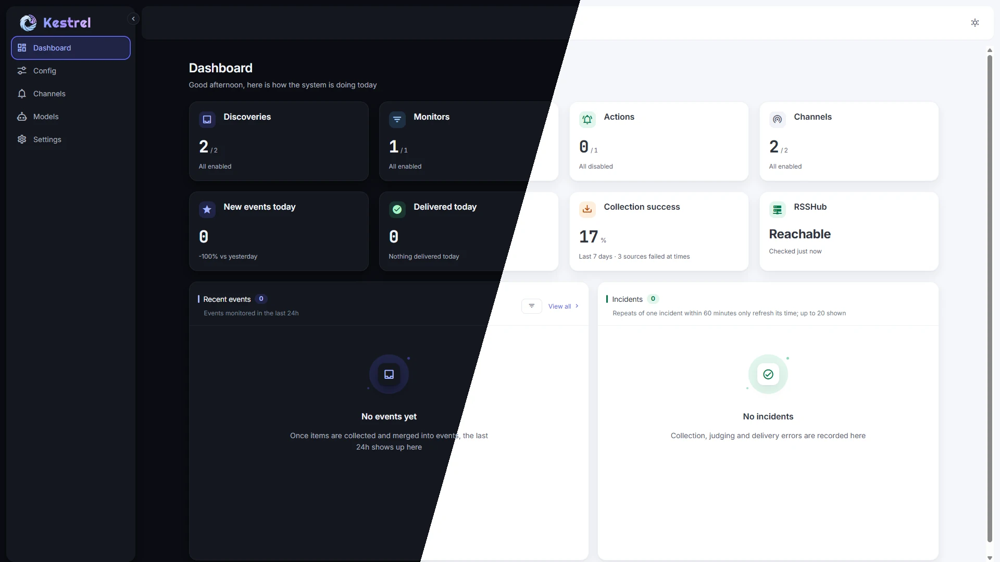

# Kestrel Radar

<p align="center">
  <a href="README.md">简体中文</a> · <a href="README.en.md">English</a>
</p>

<p align="center">
  
</p>
<p align="center"><strong>Let what matters find you.</strong></p>

<p align="center">
  <a href="https://github.com/raythalis/KestrelRadar/stargazers"></a>
  <a href="LICENSE"></a>
  <a href="docs/deployment.en.md"></a>
  <a href="docs/deployment.en.md"></a>
  <a href="docs/deployment.en.md"></a>
  <a href="docs/deployment.en.md"></a>
</p>
<p align="center">
  <a href="docs/usage.en.md#what-is-rsshub-and-how-do-i-find-a-route"></a>
  <a href="docs/usage.en.md#configure-and-test-notification-channels"></a>
  <a href="docs/usage.en.md#configure-and-test-notification-channels"></a>
  <a href="docs/llm-plus.en.md"></a>
  <a href="docs/llm-plus.en.md"></a>
  <a href="docs/usage.en.md"></a>
  <a href="docs/usage.en.md"></a>
  <a href="docs/usage.en.md"></a>
</p>
<p align="center">
  <a href=".github/workflows/ci.yml"></a>
</p>

Kestrel Radar is a self-hosted information watcher: choose where to collect, what deserves your attention, and where matched events should go. Instead of refreshing each site yourself, let new content travel through **Discoveries → Monitors → Events → Actions**.

> **A concrete example:** add an RSS feed or [RSSHub route](docs/usage.en.md#what-is-rsshub-and-how-do-i-find-a-route), choose keywords and a collection schedule, and Kestrel Radar will merge relevant new items into events and deliver them to Telegram or Webhook. The first collection establishes a baseline; existing items are not sent as new notifications.

This is **not a preconfigured trending feed**: you define your own sources and interests. Algorithmic judgment works without a model; LLM+ is optional and evaluates titles, summaries, and optional interest descriptions—not article bodies.

### Why Kestrel Radar

- **A companion to RSSHub:** RSSHub offers thousands of routes that turn sites into subscribable feeds. Connect Kestrel Radar to your own RSSHub instance to collect, filter, and notify on what matters. Direct RSS and Atom feeds and web feed discovery work too.
- **Your interests, not a preset trending list:** you choose the sources. Each Discovery has its own collection schedule; Monitors decide which new items become Events.
- **Bring your own model—or none at all:** algorithm-only judgment works without an AI service. For an extra check, connect an OpenAI-compatible API or a local Ollama model you configure yourself; only titles, summaries, and optional interest descriptions are evaluated. Kestrel Radar neither hosts models nor charges for model calls; any remote provider fees depend on the service you choose. [See when models are called](docs/llm-plus.en.md). This does not generate summaries, translations, or trend reports.
- **One path from discovery to delivery:** accepted items form Events, related sources can merge, and Actions deliver immediately or as a daily digest. Telegram and generic Webhook work today; other native channels are future directions below.
- **Made for phones and desktops:** the responsive layout adapts navigation, lists, and dialogs to narrower screens, so you can review Events and manage Monitors and settings in a mobile browser. Mobile-friendly does not mean offline support or a complete installable PWA.
- **Bilingual UI and two themes:** the interface and public guides are in Chinese and English; switch between light and dark modes. The actual Dashboard is shown below in both themes.

### Preview

<p align="center">
  
</p>
<p align="center"><em>Actual Dashboard screenshots: dark on the left, light on the right.</em></p>

## Documentation

- [First-use guide](docs/getting-started.en.md) · [User guide](docs/usage.en.md) · [Configuration](docs/configuration.en.md)
- [Deployment](docs/deployment.en.md) · [Judgment and scoring](docs/judgment-scoring.en.md) · [LLM+](docs/llm-plus.en.md)
- [Documentation index](docs/README.en.md) · [Design guidance](docs/design/README.en.md)

The guides above are available in English. The application UI also supports Chinese and English; switch to the Chinese README for Chinese documentation.

## Quick start

Install Node.js and pnpm, obtain the repository source, then run `./start.sh` on Linux / macOS or `start.bat` on Windows from the repository root. Open <http://127.0.0.1:8765> on the same machine. These scripts run in the foreground and stop when the terminal closes or you press Ctrl+C.

For a persistent deployment, see [Docker Compose and other options](docs/deployment.en.md). The [first-use guide](docs/getting-started.en.md) walks through a discovery, monitor, and action. **Kestrel Radar currently has no user accounts or authentication. Do not expose it directly to the public internet.**

## Features and roadmap

✅ **Implemented** · ⬜ **Future direction** (not yet implemented, with no committed schedule or release). You can connect some third-party services via your own Webhook, but that is not native integration.

### Discoveries

| Feature | Status | Details |
| --- | :---: | --- |
| RSS feeds | ✅ | Collect from RSS URLs on a schedule |
| Atom feeds | ✅ | Collect from Atom URLs on a schedule |
| RSSHub routes | ✅ | Connect to a separate RSSHub instance; [browse routes](https://docs.rsshub.app/routes/) |
| Web feed discovery | ✅ | Look for RSS / Atom links advertised by a web page; does not fetch arbitrary article bodies |
| Collection schedules | ✅ | Configure each Discovery's frequency |
| Keyword matching | ✅ | Monitors support any/all matching and exclusions |
| Multi-source event merging | ✅ | Combine relevant items into Events; delivered Events are normally not notified again |

### Judgment

| Feature | Status | Details |
| --- | :---: | --- |
| Algorithm-only judgment | ✅ | Filter with keywords and local scoring rules; no model required |
| Algorithm + AI judgment | ✅ | Optional; after local rules pass, your configured model can review titles, summaries, and interest descriptions |

### Actions

| Feature | Status | Details |
| --- | :---: | --- |
| Telegram | ✅ | Native channel with a test-message action |
| Webhook | ✅ | Deliver JSON to your own endpoint |
| Instant delivery | ✅ | Deliver newly matched events after collection and judgment |
| Daily digest | ✅ | Send a digest at the time configured for an Action |
| WeChat | ⬜ | Native adapter is a future direction; no built-in channel today |
| WeCom | ⬜ | Native adapter is a future direction; no built-in channel today |
| DingTalk | ⬜ | Native adapter is a future direction; no built-in channel today |
| Feishu | ⬜ | Native adapter is a future direction; no built-in channel today |

### Runtime

| Feature | Status | Details |
| --- | :---: | --- |
| Dashboard | ✅ | View events and runtime statistics |
| Incidents | ✅ | View collection, judgment, and delivery errors |
| Light and dark modes | ✅ | Two display themes |
| Mobile layout | ✅ | Responsive navigation, lists, and dialogs in a mobile browser |
| Linux start script | ✅ | Run `start.sh` on Linux |
| macOS start script | ✅ | Run `start.sh` on macOS; this is not an installer |
| Windows start script | ✅ | Run `start.bat` on Windows |
| Docker Compose | ✅ | Local build configuration in the repository; see [deployment](docs/deployment.en.md) |
| GitHub Actions CI | ✅ | Pushes to develop/main and PRs check formatting, types, tests, app build, and Docker build; only a verified v* tag publishes to GHCR |
| Full PWA experience | ⬜ | A web manifest exists, but offline support and the complete install flow do not; plain LAN HTTP is not an installable context |
| Native macOS package | ⬜ | The macOS script works today; there is no native installer |
| Electron desktop app | ⬜ | Future direction; no desktop app yet |

### i18n

| Feature | Status | Details |
| --- | :---: | --- |
| Simplified Chinese | ✅ | Available in the interface and user guides |
| English | ✅ | Available in the interface and user guides |
| Other languages | ⬜ | Developers are welcome to contribute translations and localization |

### MCP

| Feature | Status | Details |
| --- | :---: | --- |
| MCP server | ⬜ | Future direction; there is no endpoint for MCP clients today |

Future directions may change or be cancelled; rely on the code and releases for delivered functionality.

## Security and limitations

- **There are no accounts or built-in authentication.** Scripts and manual startup listen on `127.0.0.1` by default; Docker Compose publishes port `8765` on host interfaces. For remote access, use a VPN or an HTTPS reverse proxy with authentication.
- Kestrel Radar is designed for personal single-user hosting with a single SQLite database, not multi-instance high availability. Its data contains channel credentials and model API keys; protect the directory and backups.
- The algorithm-only mode does not need a model. LLM+ requires a configured model. RSSHub route availability depends on the RSSHub instance, required route configuration, and the source website.

## Development

```bash
pnpm install
pnpm dev            # web development server with hot reload
pnpm test:unit      # monorepo unit tests
pnpm type-check     # monorepo type checking
pnpm build          # production build
pnpm format         # apply the repository's Prettier rules
```

- `main` contains releasable code; day-to-day development happens on `develop`, with `feat/*` and `fix/*` branches based on `develop`. Type checking, unit tests, and production build must pass before merging to `main`.
- The repository uses single quotes, no semicolons, and a 100-column Prettier width (Vue template attributes use double quotes).

## Star History

[](https://www.star-history.com/#raythalis/KestrelRadar&Date)

## License

[GPL-3.0](LICENSE) (SPDX: `GPL-3.0-only`), Copyright (C) 2026 Raythalis.

Bundled fonts Inter and JetBrains Mono retain their SIL OFL 1.1 licenses, and Material Design Icons retains Apache-2.0; the license texts are under `apps/web/src/assets/fonts/`.
