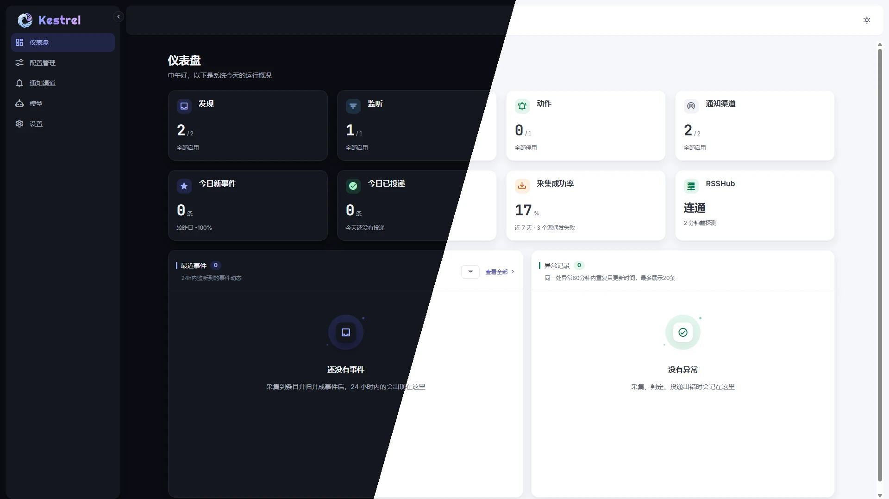

# Kestrel Radar

<p align="center">
  <a href="README.md">简体中文</a> · <a href="README.en.md">English</a>
</p>

<p align="center">
  
</p>
<p align="center"><strong>让你关心的消息，自己找上门。</strong></p>

<p align="center">
  <a href="https://github.com/raythalis/KestrelRadar/stargazers"></a>
  <a href="LICENSE"></a>
  <a href="docs/deployment.md"></a>
  <a href="docs/deployment.md"></a>
  <a href="docs/deployment.md"></a>
  <a href="docs/deployment.md"></a>
</p>
<p align="center">
  <a href="docs/usage.md#rsshub-是什么怎么找路由"></a>
  <a href="docs/usage.md#配置与测试通知渠道"></a>
  <a href="docs/usage.md#配置与测试通知渠道"></a>
  <a href="docs/llm-plus.md"></a>
  <a href="docs/llm-plus.md"></a>
  <a href="docs/usage.md"></a>
  <a href="docs/usage.md"></a>
  <a href="docs/usage.md"></a>
</p>
<p align="center">
  <a href=".github/workflows/ci.yml"></a>
</p>

Kestrel Radar 是自托管的信息监听工具：自己决定从哪里采集、什么值得关注、命中后通知到哪里。不用在各个网站间来回刷新，让新内容沿着「**发现 → 监听判定 → 事件 → 动作投递**」流到你手里。

> **一个具体场景**：添加 RSS 源或 [RSSHub 路由](docs/usage.md#rsshub-是什么怎么找路由)，设定关注词和采集时间；有新内容命中时，Kestrel Radar 会把相关条目归并为事件，并通过 Telegram 或 Webhook 投递。首次采集只建立基线，不会把已有内容当成新消息。

它**不是预置全网热榜**：来源和关注条件由你配置。算法判定可独立运行，LLM+ 可选；模型只判断标题、摘要及可选的关注意图，不读取文章正文。

### 产品亮点

- **RSSHub 的好搭档**：RSSHub 提供数千条网站路由，把不同站点变成可订阅的内容；Kestrel Radar 连接你自己的 RSSHub 实例，按计划采集、筛选并通知你。也能直接订阅 RSS、Atom，或从网页发现订阅源。
- **按兴趣筛选，不靠热榜替你决定**：来源由你选；每个发现有自己的采集计划，监听规则控制什么内容进入事件。
- **模型用你自己的，完全可选**：不配置模型也能用纯算法判定；需要进一步复核时，可连接你自行配置的 OpenAI 兼容接口或 Ollama 本地模型，只判断标题、摘要和可选的关注意图。Kestrel Radar 不提供模型服务，也不向你收取模型调用费；远程服务是否收费取决于你选用的供应商。[了解调用条件](docs/llm-plus.md)。这不是 AI 摘要、翻译或热点分析报告。
- **从发现到投递是一条链**：通过判定的新条目才形成事件；相关来源可归并，即时投递或按天汇总。Telegram 和通用 Webhook 已支持，其他原生渠道见下方计划。
- **手机和桌面都好用**：响应式布局会随屏幕宽度调整导航、列表和弹窗；在手机浏览器也能查看事件、管理监听与设置。移动端适配不等于离线可用或完整 PWA 安装。
- **中英双语、明暗主题**：应用界面和公开使用文档都有中英文版本；亮色与暗色主题可切换。下面用真实仪表盘展示两种主题。

### 界面预览

<p align="center">
  
</p>
<p align="center"><em>实际仪表盘截图：左暗右亮。</em></p>

## 文档

- [快速开始教程](docs/getting-started.md) · [使用手册](docs/usage.md) · [配置](docs/configuration.md)
- [部署](docs/deployment.md) · [判定与打分](docs/judgment-scoring.md) · [LLM+](docs/llm-plus.md)
- [文档目录](docs/README.md) · [设计规范](docs/design/README.md)

应用界面与上述使用文档都有中英文版本；切换到 [English README](README.en.md) 可进入英文文档。

## 快速开始

准备 Node.js 和 pnpm，取得本仓库源码后，在仓库根目录运行 `./start.sh`（Linux / macOS）或 `start.bat`（Windows）。脚本会构建并启动服务；在运行它的设备上打开 <http://127.0.0.1:8765>。这是前台进程，关闭终端或按 Ctrl+C 就会停止。

需要常驻运行或使用镜像？看 [Docker Compose 与其他部署方式](docs/deployment.md)。从第一次配置到收到事件的步骤见[快速开始教程](docs/getting-started.md)。**当前应用没有账号与鉴权，不要直接暴露到公网。**

## 功能与计划

✅ **已实现** · ⬜ **后续方向**（尚未实现、没有确定的排期或版本承诺）。Webhook 可以自行对接第三方，但不等于对应平台已有原生支持。

### 发现

| 能力 | 状态 | 说明 |
| --- | :---: | --- |
| RSS 订阅 | ✅ | 添加 RSS 地址，按计划采集 |
| Atom 订阅 | ✅ | 添加 Atom 地址，按计划采集 |
| RSSHub 路由 | ✅ | 使用独立 RSSHub 实例；[查找官方路由](https://docs.rsshub.app/zh/routes/) |
| 网页订阅源发现 | ✅ | 从网页声明中寻找 RSS / Atom；不抓取任意正文 |

### 判定

| 能力 | 状态 | 说明 |
| --- | :---: | --- |
| 纯算法判定 | ✅ | 无需配置模型，按关键词与本地打分规则筛选内容 |
| 算法 + AI 判定 | ✅ | 可选；在本地规则放行后按需调用你配置的模型复核标题、摘要与关注意图 |

### 动作

| 能力 | 状态 | 说明 |
| --- | :---: | --- |
| Telegram | ✅ | 原生通知渠道，支持测试消息 |
| Webhook | ✅ | 向自有接收地址投递 JSON |
| 即时投递 | ✅ | 符合条件的新内容经判定后投递 |
| 每日汇总 | ✅ | 按动作设置的时间汇总投递 |
| 微信 | ⬜ | 后续考虑原生适配，目前没有内置渠道 |
| 企业微信 | ⬜ | 后续考虑原生适配，目前没有内置渠道 |
| 钉钉 | ⬜ | 后续考虑原生适配，目前没有内置渠道 |
| 飞书 | ⬜ | 后续考虑原生适配，目前没有内置渠道 |

### 运行

| 能力 | 状态 | 说明 |
| --- | :---: | --- |
| 移动端适配 | ✅ | 响应式导航、列表与弹窗，可在手机浏览器使用 |
| Linux 启动脚本 | ✅ | `start.sh` 可在 Linux 运行 |
| macOS 启动脚本 | ✅ | `start.sh` 可在 macOS 运行；不是安装包 |
| Windows 启动脚本 | ✅ | `start.bat` 可在 Windows 运行 |
| Docker Compose | ✅ | 仓库提供本地构建配置；[部署方式](docs/deployment.md) |
| 完整 PWA | ⬜ | 已有网页 manifest，离线与完整安装体验未实现；普通局域网 HTTP 不满足安装条件 |
| macOS 原生安装包 | ⬜ | macOS 现在可通过脚本运行；没有原生安装包 |
| Electron 桌面版 | ⬜ | 计划方向，目前没有桌面应用 |

### i18n

| 能力 | 状态 | 说明 |
| --- | :---: | --- |
| 简体中文 | ✅ | 界面与使用文档均提供简体中文版 |
| English | ✅ | 界面与使用文档均提供英文版 |
| 其他语言 | ⬜ | 欢迎开发者参与翻译与适配 |

### MCP

| 能力 | 状态 | 说明 |
| --- | :---: | --- |
| MCP 服务端 | ⬜ | 后续方向；当前没有供 MCP 客户端连接的端点 |

后续方向可能调整或取消；以实际代码和发布说明为准。

## 安全与限制

- **没有账号体系或鉴权。** 脚本和手动启动默认只监听 `127.0.0.1`；Docker Compose 将 `8765` 映射到主机网络接口。需要远程访问请使用 VPN，或在反向代理前加身份验证与 HTTPS。
- SQLite 单文件、单用户使用场景，没有多实例或高可用设计。数据库包含渠道密钥与模型 API Key，请保护数据目录及备份。
- 不启用 LLM+ 时可只用算法判定；启用后先配置可用模型。RSSHub 路由能否采集还取决于实例、路由配置与目标站状态。

## 开发

```bash
pnpm install
pnpm dev            # 前端开发服务器（含热更新）
pnpm test:unit      # 全仓单元测试
pnpm type-check     # 全仓类型检查
pnpm build          # 生产构建
pnpm format         # 按仓库统一的 Prettier 规则格式化
```

- 分支约定：`main` 只放可用成品，合并前必须通过类型检查、单元测试与生产构建；日常开发在 `develop`，功能分支 `feat/*`、`fix/*` 从 `develop` 切出。
- 代码风格：单引号、不写分号、每行最多 100 列（根目录 `.prettierrc.json`，Vue 模板属性用双引号）。

## Star History

[](https://www.star-history.com/#raythalis/KestrelRadar&Date)

## 许可证

[GPL-3.0](LICENSE)（SPDX：`GPL-3.0-only`），Copyright (C) 2026 Raythalis。

随仓库分发的第三方资源各自保留原许可证：界面字体 Inter、JetBrains Mono（SIL OFL 1.1）与图标 Material Design Icons（Apache-2.0），许可证文本在 `apps/web/src/assets/fonts/` 下。
